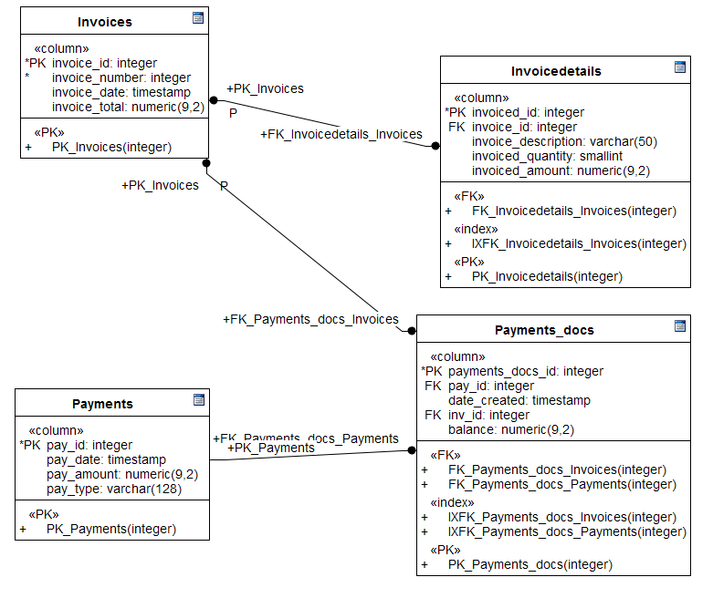
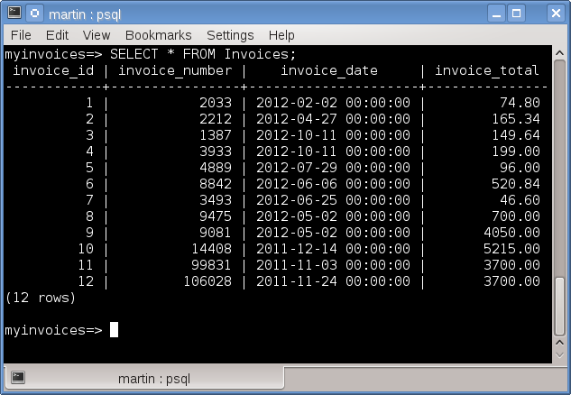
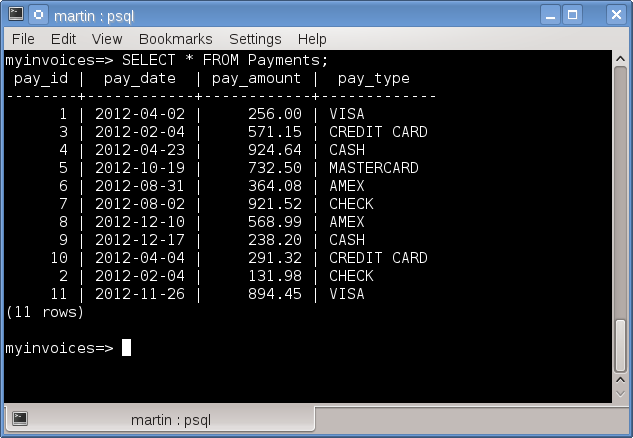
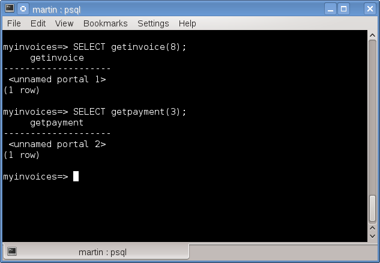
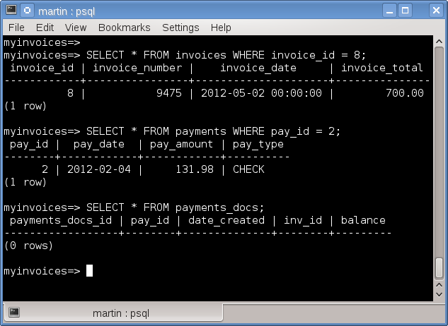
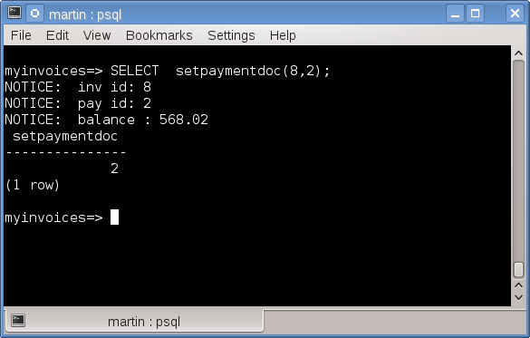
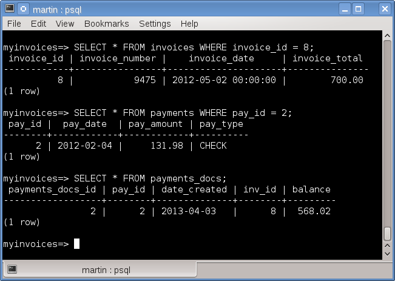

# Utilizando refcursors  (cursores de referencia) en PostgreSQL

Esta una entrada complementaria a un post anterior acerca del uso de cursores en PostgreSQL.

Después de que se han obtenido los registros de un cursor abierto con el comando FETCH  entonces ya podemos asignar los valores de esos registro a ciertos tipos de variables, los tipos de variable que se utilizan para el trabajo con cursores son:
<ol>
<li><b>Mismo tipo de datos que cada una de las columnas obtenidas por el cursor.</b></li>
<li><b>TYPE</b></li>
<li><b>RECORD</b></li>
<li><b>ROWTYPE</b></li>
</ol>
Como ejemplo para el primer tipo de variable programaremos una función PL/SQL con <b>refcursors</b>,en PostgreSQL un <b>refcursor</b> (cursor de referencia) es un cursor que se construye en  runtime(tiempo de ejecucción), como su nombre indica es la referencia a un cursor.  Usaremos el siguiente schema como parte del ejemplo:

 

Este schema representa una estructura básica para la contabilidad de pagos y documentos, en donde cada pago recibido debe ser aplicado a un documento y reducir su monto.

Consultamos la tabla invoices
 

 

Consultamos los pagos
 

 

La aplicación de un pago hacia un documento debe generar un registro en la tabla <i>payments_docs</i> así que el próposito del código PL/SQL como ejemplo es asociar un pago aplicado a una factura y actualizar su monto.  
Esta funcionalidad la creamos con el siguiente código PL/SQL, que consiste de dos funciones de apoyo <i>getinvoice()</i>, <i>getpayment()</i> y una función principal <i>setpaymentdoc(p_inv_id numeric,p_pay_id numeric)</i>.
Con esta función regresamos un cursor de referencia con los datos de una factura de la tabla <i>invoices</i>.

Al ejecutar las funciones <i>getinvoice()</i> y <i>getpayment()</i>, ambas regresan un cursor de referencia.
 

 

Antes de ejecutar el procedimiento consultamos el pago y la factura de las cuales se obtendrán los datos  para crear el registro en la tabla de relación <i>payments_docs</i>, como resultado de la ejecucción del procedimiento.

 

En la primera función  <i>getinvoice()</i> observamos como el tipo de valor devuelto es un cursor de referencia, esto mediante la sentencia <b><i>RETURNS refcursor AS</i></b>

<pre>
CREATE FUNCTION getinvoice(p_inv_id numeric) RETURNS refcursor AS 
</pre>

Declaramos la variable con el tipo <i>refcursor</i>(cursor de referencia) para contener el cursor devuelto por la función

<pre>
 v_cursor_inv refcursor;
</pre>

El cursor devuelto lleva asociado las columnas de la consulta a la tabla <i>invoices</i>, la cuál se encuentra asociada al cursor.

<pre>
OPEN v_cursor_inv FOR SELECT invoice_id,invoice_total FROM invoices 
 WHERE invoice_id = p_inv_id;
</pre>

finalmente devolvemos la variable a la cual le asignamos el cursor.

<pre>
return v_cursor_inv;
</pre>

La función  <i>getpayment()</i> es similar a la función  <i>getinvoice()</i> lo que cambia es la consulta asociada a su cursor de referencia.
En la función principal  <i>setpaymentdoc(p_inv_id numeric,p_pay_id numeric)</i>  declaramos las variables que almacenarán los cursores de referencia y las variables que almacenarán a las columnas que cada cursor tenga asociadas como parte de su consulta SQL.

<pre>
DECLARE

resp int;
 v_payment refcursor;
 v_invoice refcursor;
 v_invoice_id int;
 v_invoice_total numeric(9,2);
 v_pay_id int;
 v_pay_amount numeric(9,2);
 v_balance numeric(11,2);

</pre>

Ahora almacenamos los cursores devueltos por las funciones <i>getinvoice()</i> y <i>getpayment()</i> en las variables  <i>v_invoice</i> y <i>v_payment</i>  respectivamente.

<pre>

v_invoice := getinvoice(p_inv_id);
v_payment := getpayment(p_pay_id);

</pre>

Una vez guardado el cursor en la variable, podemos extraer los valores de las columnas y almacenarlos en su variable correspondiente,  esto lo hacemos con el comando FETCH INTO.

<pre>
FETCH [cursor name] INTO [variable1, variable2, ….n].

FETCH v_invoice INTO v_invoice_id,v_invoice_total;
 CLOSE v_invoice;
</pre>

Es obligatorio que la variable que guarda el valor de la columna sea del mismo tipo de dato que la columna extraída  del cursor.
Por último insertamos la relación en la tabla utilizando los valores guardados en las variables, y regresando el número de secuencia.

<pre>
v_balance := v_invoice_total - v_pay_amount;
 raise NOTICE 'balance : %',v_balance;
 INSERT INTO payments_docs(pay_id,inv_id,balance,date_created)
 VALUES(v_pay_id,v_invoice_id,v_balance,now());
 resp := currval('payments_docs_payments_docs_id_seq');
</pre>

Al ejecutar el procedimiento con todos sus argumentos se mostrará el resultado como se ve en la siguiente imagen:

 

Ahora consultamos la tabla de relación, para ver el registro creado, resultado de la ejecución del procedimiento.

